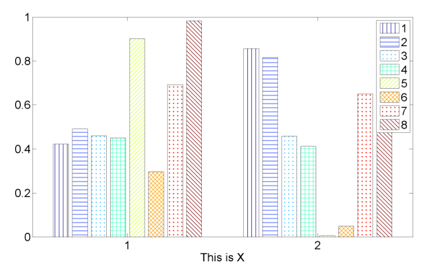
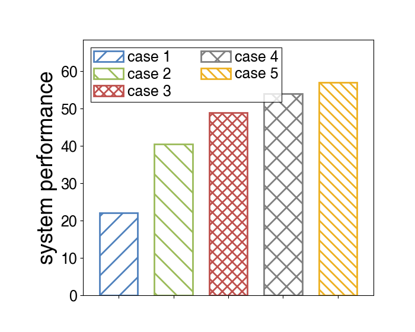

# bar_with_hatch_tool
## Motivation

I used to do experiment result visualization for my paper by matlab. However, I found that bar graph with hatchs done by `applyhatch_pluscolor` in matlab looked so strange: the bars with color stripe have black outlines ?!

So I use `matplotlib` in python to develop a small tool to draw colorful bars with hatch, and I do my best to make its style coherent with those done by matlab.

## Requirements

`Python3` are required. 

And two packages are used to support this tool: `argparse` and `matplotlib`.

## Quick start

run `sh draw.sh` , you will get an example figure `test.png`.

- `s.p.` Since I want to use the same font as what I use in matlab, font `Helvetica` is used as default setting. If you found a error causing by `Helvetica` is not included in your `matplotlib`, just 
  - Change a font by including `--font XXX` as you like in parameters in `draw.sh`
  - Or your can get `Helvetica.tff` and follow the instruction of error information, in which I describe how to add a font into `matplotlib`  

## Parameters

### Common Parameters

If you just want to draw a graph with example/default style, only following parameters need to be changed to your own:

- `--data`    your numerical data to draw your bars
- `--legend_list`    names of your data, one to one correspondence with numerical data
- `--y_label`    as the name says
- `--picture_name`    as the name says, but should include type as suffix. Until now three types are supported: `.png` and `.jpg` as picture and `.pdf` as PDF file.
- `--legend_position`    position of the legend, the same as which in `matplotlib`
- `--legend_column`    as the name says

### Uncommon Parameters

If you want to make more changes in graph style, the following parameters may help you; or you can change the `.py` code by yourself.

- `--x_label`     label of x-axis
- `--aspect_ratio`    aspect ratio of graphs (excluding labels)
- `--ymin`    Y-axis display minimal
- `--ymax`    Y-axis display maximal
- `--legend_fontsize`    font size of legend
- `--xticks_fontsize`    font size of xticks
- `--yticks_fontsize`    font size of yticks
- `--xlabel_fontsize`    font size of xlabel
- `--ylabel_fontsize`    font size of ylabel
- `--linewidth`    line width of bar and hatch
- `--barwidth`    width of bar (from 0 to 1)

## Example output

## Contributions

If you know how to make it better, don't hesitate to send a pull request. Thx :)